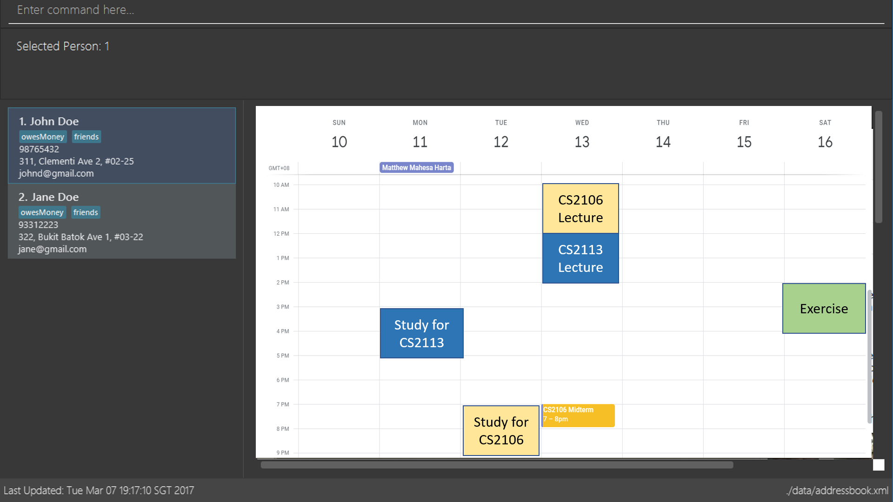

= Efficient Learning Scheduler
ifdef::env-github,env-browser[:relfileprefix: docs/]

master
https://travis-ci.org/CS2113-AY1819S2-T11-1/main[image:https://travis-ci.org/CS2113-AY1819S2-T11-1/main.svg?branch=master[Build Status]]
https://ci.appveyor.com/project/windrichie/main[image:https://ci.appveyor.com/api/projects/status/g72i5rm6vrxdb40g?svg=true[Build status]]
https://coveralls.io/github/windrichie/main?branch=master[image:https://coveralls.io/repos/github/windrichie/main/badge.svg?branch=master[Coverage Status]]

ifdef::env-github[]

endif::[]

ifndef::env-github[]
image::images/Ui.png[width="600"]
endif::[]

* This is a desktop Efficient Learning Scheduler application. It has a GUI but most of the user interactions happen using a CLI (Command Line Interface).
* It is a Java application targeting NUS School of COmputing students who are interested to learn how to learn.
* Our efficient learning scheduler implements ALSET's proven learning strategy such as spacing.
* We believe that with our application at your expense, you will be able to develop a good and efficient learning habit that will help you achieve your academic or career goals.
* With our application you can:
** Generate customised learning schedule in a calendar view by inputting your module time slots
** Receive notifications and reminders when study time is starting
** Combine your schedule with your friends' to find common timing for meetings or outings
** Keep track of NUS events and check if you are available during the time slots

== Site Map

* <<UserGuide#, User Guide>>
* <<DeveloperGuide#, Developer Guide>>
* <<AboutUs#, About Us>>
* <<ContactUs#, Contact Us>>

== Acknowledgements

* Some parts of this sample application were inspired by the excellent http://code.makery.ch/library/javafx-8-tutorial/[Java FX tutorial] by
_Marco Jakob_.
* Libraries used: https://github.com/TestFX/TestFX[TextFX], https://github.com/FasterXML/jackson[Jackson], https://github.com/google/guava[Guava], https://github.com/junit-team/junit5[JUnit5]
* AddressBook-Level4 project created by SE-EDU initiative at https://github.com/se-edu/

== Licence : link:LICENSE[MIT]
